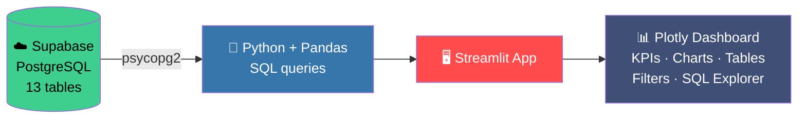
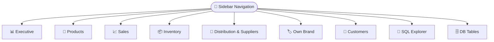
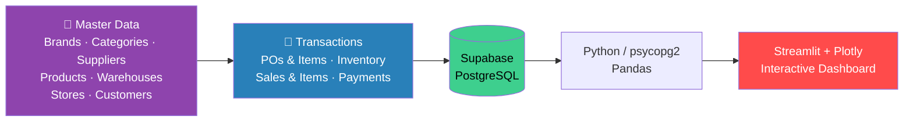

# 💄 Cosmetics Retail Intelligence

> **Distribution & retail analytics dashboard for a cosmetics, skincare & beauty-electronics business**


A full-stack analytics project that monitors **products, brands, sales, inventory, stores, customers, suppliers, purchasing, payments and own-brand performance**. Data lives in **Supabase PostgreSQL**; the dashboard is built with **Python + Streamlit + Plotly**.

**Sells:** 💄 Cosmetics · 🧴 Skincare · ⚡ Beauty electronics · 🏷️ External brands · ⭐ Own brands

**Objectives:** monitor sales & profitability · analyze products/categories · track inventory & reorders · monitor suppliers & POs · compare external vs own brands · understand customers · compare stores & channels · explore data with read-only SQL.

---

## 🏗️ Architecture



| Layer | Technology |
|---|---|
| Dashboard | Streamlit + Plotly Express |
| Language / Analysis | Python, Pandas |
| Database | PostgreSQL on Supabase (via `psycopg2`) |
| Config | `python-dotenv`, `requirements.txt` |
| Dev / VCS | Positron / venv, Git + GitHub |

---

## 🗄️ Database Design (13 tables)

**Master tables**

| Table | Stores |
|---|---|
| `brands` | Brand name, `brand_type` (**External** / **Own Brand**), country |
| `categories` | Face/Lip/Eye Makeup, Cleansers, Serums, Moisturizers, Sunscreen, Hair Styling & Facial Electronics, Beauty Accessories |
| `suppliers` | Name, contact person, phone, email, location, status |
| `products` | Name, brand, category, type, unit cost, selling price, launch date, active flag (**check: price ≥ cost**) |
| `warehouses` | Name, city, state, capacity, manager |
| `stores` | Company-owned and franchise stores |
| `customers` | Name, contact, city, state, registration date |

**Transaction tables**

| Table | Stores |
|---|---|
| `purchase_orders` | Supplier, warehouse, order/expected/actual delivery dates, status, total |
| `purchase_order_items` | PO, product, quantity, unit cost, total cost |
| `inventory` | Warehouse × product stock, reorder level, last updated (**unique per warehouse-product**) |
| `sales` | Store, customer, date, channel (**Store / Online**), total |
| `sale_items` | Sale, product, quantity, unit price, discount, total |
| `payments` | Method (**Cash / Card / UPI / Online**), status (**Paid / Pending / Refunded**) |

### 🧩 ER Diagram


> 🔗 Live version: [Supabase Schema Visualizer](https://supabase.com/dashboard/project/ffyxmgmueipjlcalzgkg/database/schemas) (requires project login). All relationships are **1 : N** (parent → child).

---

## 📊 Dashboard (9 pages)

Sidebar is used **only for navigation**. Every page has **its own independent filters**.



| # | Page | Filters | Key outputs |
|---|---|---|---|
| 1 | 📊 **Executive** | Date, store, product type, brand type, channel, category | Revenue, orders, units sold, gross profit, store performance table + chart |
| 2 | 🧴 **Product Mgmt** | Product type, brand, brand type, category, status | Product table + performance chart (cosmetics vs skincare vs electronics; external vs own) |
| 3 | 📈 **Sales Analytics** | Store, channel, product type, brand, category | Transactions, category & channel analysis (Store vs Online) |
| 4 | 📦 **Inventory** | Warehouse, product type, brand, category, brand type, stock status | Stock levels vs reorder levels, warehouse/product comparison |
| 5 | 🚚 **Distribution & Suppliers** | Supplier, warehouse, PO status | Supplier & purchase-order analysis, warehouse destinations |
| 6 | 🏷️ **Own Brand** | Category, product type, store, channel | GlowPure, DermaGlow, LumiSkin performance by category/store/channel |
| 7 | 👥 **Customers** | Store, channel | Customer-linked sales and contribution |
| 8 | 🧮 **SQL Explorer** | – | Read-only ad-hoc SQL against the database |
| 9 | 🗄️ **DB Tables** | Table selector | Inspect rows, columns and structure |

```sql
-- SQL Explorer example
SELECT brand_name, brand_type FROM brands ORDER BY brand_name;
```

**Business coverage:** Executive → 1 · Product → 2 · Sales → 3 · Inventory → 4 · Procurement & Supply Chain → 5 · Own Brand → 6 · Customers → 7 · Exploration → 8, 9

---

## 📈 Analytics Logic

```text
Gross Profit = Sales Revenue − Product Cost
```

A product-level summary view (**Product · Brand · Brand Type · Category · Product Type · Units Sold · Revenue · Gross Profit**) sits on top of the normalized tables for fast dashboard queries.

### 🔄 End-to-End Data Flow



---

## 🛠️ Project Structure

```text
Cosmetics_Retail_Capstone/
├── app.py              # Streamlit dashboard
├── requirements.txt    # Dependencies
├── .gitignore          # Excludes .env and .venv
├── .env                # Local credentials (never commit)
└── sql/
    ├── 01_schema.sql        # Table definitions
    ├── 02_master_data.sql   # Brands, categories, suppliers, products, warehouses, stores, customers
    ├── 03_transactions.sql  # POs, inventory, sales, sale items, payments
    └── 04_analytics.sql     # Analytical SQL
```

**Database setup order:** `01_schema` → `02_master_data` → `03_transactions` → `04_analytics`

---

## ⚙️ Setup & Run

```powershell
# 1. Clone
git clone https://github.com/sriveenahemadri-commits/Cosmetics-Retail-project.git
cd Cosmetics-Retail-project

# 2. Virtual environment (Windows PowerShell)
python -m venv .venv
.\.venv\Scripts\Activate.ps1
# If blocked: Set-ExecutionPolicy -ExecutionPolicy RemoteSigned -Scope CurrentUser

# 3. Install (streamlit, supabase, pandas, plotly, python-dotenv, psycopg2-binary)
pip install -r requirements.txt

# 4. Run → http://localhost:8501
streamlit run app.py
```

**`.env`** (project root):

```env
SUPABASE_URL=your_supabase_project_url
SUPABASE_KEY=your_supabase_publishable_or_anon_key
DATABASE_URL=your_postgresql_connection_string
```

---

## 🔒 Security

- **Never commit:** `.env`, `.venv/`, DB passwords, connection strings, service-role keys, API secrets.
- Credentials are read from environment variables, never hard-coded in `app.py`.
- If a credential is ever exposed, **rotate it** immediately.

---

## 🚀 Future Enhancements

Authentication & roles · sales and demand forecasting · low-stock alerts · supplier delivery KPIs · customer segmentation · recommendations · promotion analysis · scheduled reports · advanced profitability · cloud deployment · Supabase CLI migrations

---
## 📌 Entity Relationship Diagram of the Database


## 📌 Links

- **GitHub:** [Cosmetics Retail Intelligence](https://github.com/sriveenahemadri-commits/Cosmetics-Retail-project)
- **Supabase Schema:** [Open Schema Visualizer](https://supabase.com/dashboard/project/ffyxmgmueipjlcalzgkg/database/schemas)

**Cosmetics Retail Intelligence** — Supabase PostgreSQL + Python + Streamlit + Pandas + Plotly
